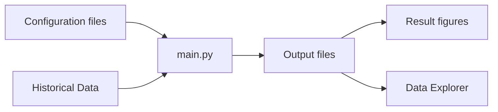
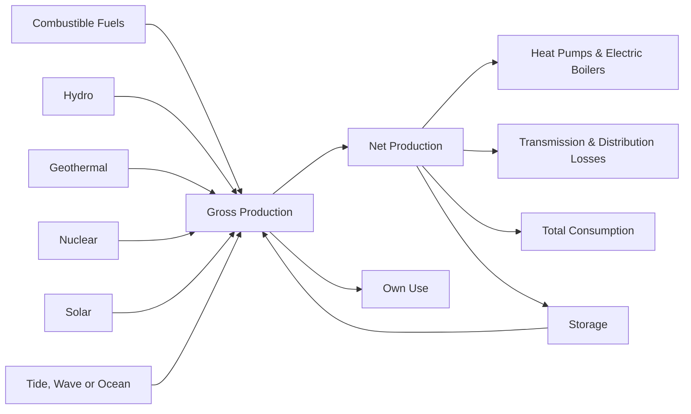
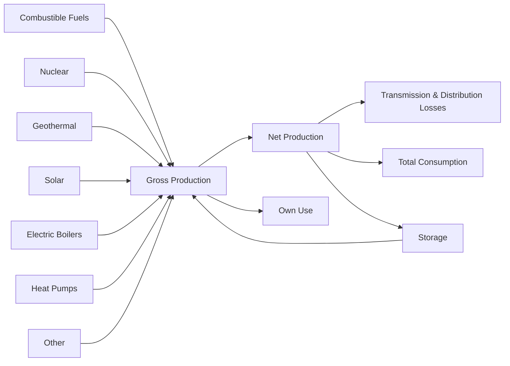

# Model Workflow

```mermaid
graph LR
   A[Configuration files]--> G[main.py]
   B[Historical Data] --> G
   G --> I[Output files]
   I-->J[Result figures]
   I-->O[Data Explorer]
```

# Electricity Flow Chart

```mermaid
graph LR
   A[Combustible Fuels]--> G[Gross Production]
   B[Hydro] --> G
   C[Geothermal]--> G
   D[Nuclear]--> G
   E[Solar]--> G
   F[Tide, Wave or Ocean] --> G
   G --> I[Net Production]
   I-->J[Heat Pumps & Electric Boilers]
   I-->O[Transmission & Distribution Losses]
   I-->M[Total Consumption]
   I-->K[Storage]-->G
   G--> H[Own Use]
```

# Heat Flow Chart

```mermaid
graph LR
    A[Combustible Fuels]--> G[Gross Production]
    B[Nuclear] --> G
    C[Geothermal]--> G
    E[Solar]--> G
    F[Electric Boilers] --> G
    Z[Heat Pumps] --> G
    Other[Other] --> G
    G --> I[Net Production]
    I-->O[Transmission & Distribution Losses]
    I-->M[Total Consumption]
    I-->K[Storage]-->G
    G--> H[Own Use]
```
