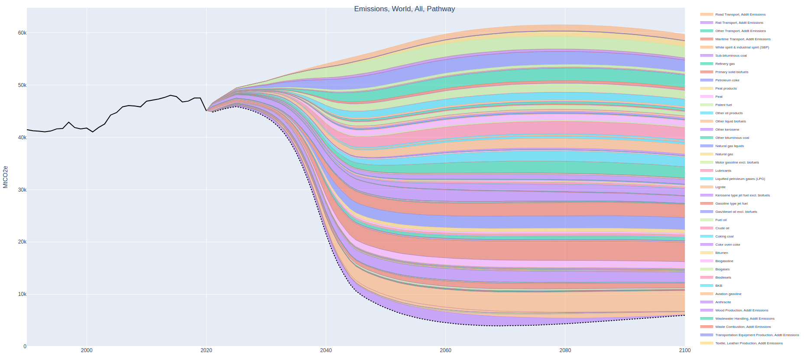

# Positive Disruption



## What is Positive Disruption?

Positive Disruption is a model for exploring potential scenarios in which technologies and practices that impact GHG emissions, referred to as ‘climate solution verticals', might be adopted between now and the end of the century, globally and by nation, and estimating their impact on GHG emissions.

The Positive Disruption model explores how the adoption of a set of climate solution verticals, when assumed to have optionality for nonlinear adoption curves, can impact GHG emissions. It provides timeseries estimates of global progress as a summation of national progress.

Suggested uses for the model include:

- To explore climate trajectories that are influenced by technology market disruption
- To understand options for applying additional market acceleration efforts

## Documentation

Additional model documentation is located in our [Wiki](https://github.com/Epic-Institute/positive-disruption/wiki/Positive-Disruption-Model-Supplemental-Information).

## How to install

1. Clone this repository and open the directory on your local machine.

2. Create and activate a virtual environment. 

```shell
$ python3 -m venv .env
$ source .env/bin/activate
```
3. Install dependencies

```shell
(.env) $ make install
```

4. Run podi/data/IEA/splitregions.sh. This will produce input data in /positive-disruption/podi/data/IEA .

```shell
(.env) $ bash podi/data/IEA/splitregions.sh
```

5. Run main.py. This will produce output datasets in /positive-disruption/podi/data/output .

```shell
(.env) $ python3 main.py
```

6. To view the interactive Data Explorer, run podi/app.py and click the link that appears to open it in a web browswer.

```shell
(.env) $ python3 podi/app.py
```

## How to contribute

1. Make sure you are running in a virtual environment (e.g., `python3 -m venv .env`)
2. Activate it (e.g. `source .env/bin/activate`)

```shell
(.env) $ make install-dev
```

3. Run the tests

```shell
(.env) $ make test
```

4. For more help:
```shell
(.env) $ make help
```

Please submit pull requests for any bugs identified and/or fixed, as well as new feature suggestions.

## Feedback

Feedback in the form of suggested improvements to the data or code are welcome, just submit a pull request.

Feel free to share any other feedback on our [Discussions](https://github.com/Epic-Institute/positive-disruption/discussions) page.

## Copyright

Copyright (c) 2022 Epic Institute

## License

See our <b>License</b> file 
