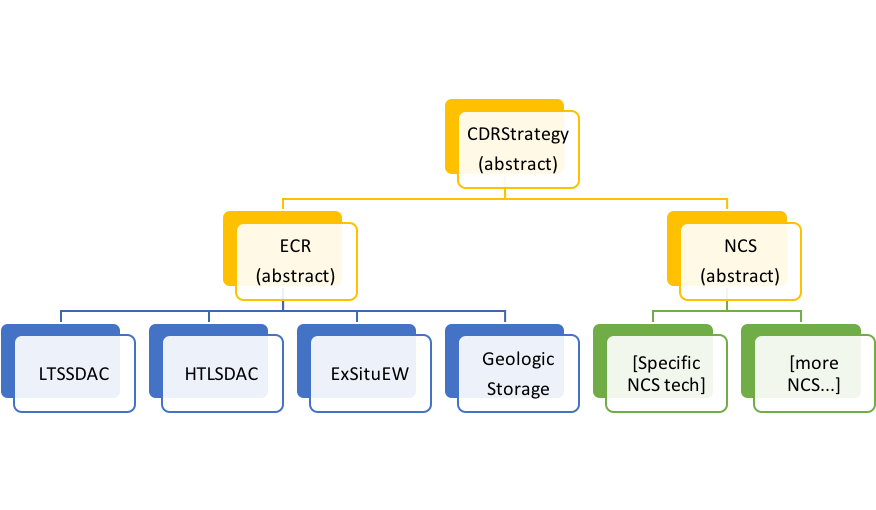

# CDR Module Structure

The following files play the following roles:

1. **cdr_main.py:** implements yearly optimization framework and is the module’s main public interface; exports the cdr_mix function, the primary public-facing function.
2. **cdr_util.py:** defines constants and utility functions used throughout the module.
3. **cdr_abstract_types.py:** defines the inheritance hierarchy for CDR project objects.
4. **ecr_types.py:** implements behavior of specific ECR CDR strategies.
5. **ncs_types.py:** implements behavior of specific NCS CDR strategies.

# Module inputs and outputs

Inputs | Outputs
------ | -------
Annual MtCO2 CDR requirements | Cost-optimal mix of CDR capacity in each year, by CDR technology (MtCO2/yr)
Start year and end year | Total cost in each year (MM$), adjusted for CDR credits
Emissions intensity of: **1)** Grid electricity (tCO2/TWh), **2)** Heat production (tCO2/MWh), **3)** Transportation (tCO2/t*km), **4)** Liquid fuels (tCO2/MWh) | Annual energy use (TWh), separated into: **1)** Grid electricity, **2)** Heat use, **3)** Transportation, **4)** Liquid fuels

# Optimization Process

Here is the basic logic and the underlying set of assumptions for the current process to determine an approximately cost-optimal mix of CDR technologies in each year.

## The Process
* For each year from the start (2020) to the end (2100):
    * Handle project retirements
        * Retire old plants that have reached the end of their lifetimes
        * Remove capacity for de-adopting technologies (e.g. natural carbon sinks that are saturating or other technologies with negative growth curves)
            * The capacity that is removed for de-adopting technologies is that of the oldest installed plants for that technology. These are either the most expensive or the closest to retirement anyways.
    * Determine how much additional CDR needs to be deployed in that year
	* Computed as the difference between the previous year’s existing global CDR capacity and the current year’s required CDR capacity, plus any retirements listed above or CO2 leakage from geologic storage.
    * Rank each available technology by cost, using a priority queue.
    * Deploy 1 MtCO2 of CDR at a time from the cheapest technology until it either runs out or is no longer the cheapest technology, or until the required CDR quota has been filled.
        * Note that the currently cheapest technology may change during a year if one technology is exhausted or becomes more expensive.
        * Storage is deployed along with some capture projects, if required.
    * This yields a technology mix that minimizes the cost in each consecutive year, where each decision is made with no consideration given to following years.

## Calculations
* Effective CDR factor for a project (i.e. net tCO2 removed per tCO2 capacity) = `1-x`
    * x is tons incidental CO2 emissions (e.g. from energy production) per ton CO2 removed.
* Costs are based on each 1 MtCO2/yr project’s levelized cost, their net CDR efficiency (accounting for incidental emissions), and the annual carbon price.
    * _{baseline}*\frac{1}{\textup{effective&space;CDR&space;factor}}-\frac{1}{T}*\sum_{y=y_0}^{y_0&plus;T}\frac{\textup{credit&space;price}(y)}{(1&plus;r)^{(y-y_0)}})
    * *T* is lifetime, *y_0* is project deployment year, *r* is discount rate.
* Energy use is based on each 1 MtCO2/yr project’s base energy use (per tCO2) and adjusted for its net CDR efficiency. Split into electricity/heat/transportation/fuels.
    * _{baseline}*\frac{1}{\textup{effective&space;CDR&space;factor}})
* Max annual adoption potential (limit to how much new capacity can be deployed in a year) for each technology is the slope of its market penetration curve, in the absence of competing CDR technologies, at its current deployment level.
    * For example, given a logistic adoption function =M\left\[\frac{e^{(a&plus;bt)}}{1&plus;e^{(a&plus;bt)}}\right\]) and some current adoption level *n*, the slope of this logistic curve at the point where the adoption level (y-value) equals *n* is =\textup{slope&space;of&space;}N(t)\textup{&space;where&space;}N\textup{&space;equals&space;}n), which is the value of \right\)), i.e. the adoption slope at the time on the logistic graph corresponding to adoption level n.

## Assumptions
* CDR is simultaneously deployed all at once at the beginning of each year.
* 5% discount rate.
* DAC, EW, and geologic storage projects have constant costs throughout their lifetime.
* The capture step is assumed to be the limiting step, so geologic storage is assumed to have unlimited potential.
* DAC projects can achieve up to a 90% reduction in CAPEX via learning.
* Storage projects are levelized using the same lifetime as their paired capture project.
* Transportation mix has a (trucking : shipping : rail) split of (30.7 : 10.5 : 2.4), based on relative global energy use of freight transport modes based on the [EIA 2019 energy outlook.](https://www.eia.gov/outlooks/aeo/data/browser/#/?id=51-IEO2019)
* Default energy source emissions intensity assumptions described in cdr_util.
* All electricity is assumed to come from the grid.
* All liquid fuels are assumed to be diesel.
* In the event that there is more existing CDR capacity than needed for a year, energy costs and variable O&M are scaled down to reflect the decreased utilization. Capital costs and fixed O&M are assumed to be 1/2 of total costs and are still summed in full in such situations.

# Extending this module

## Current Class Structure

Each MtCO2/yr of CDR is represented in the optimization framework as a concrete instance of an ECR or NCS subclass of the CDRStrategy abstract superclass (currently all project objects have a capacity of 1 MtCO2/yr). The current inheritance hierarchy is as follows:
 


Yellow classes are abstract classes that cannot be instantiated. Blue classes are concrete classes that have already been implemented. Green classes are concrete classes that have not yet been implemented.

## Adding new CDR strategies

All new CDR strategies should be implemented as concrete subclasses of ECR (in erc_types.py) or NCS (in ncs_types.py), depending on which best characterizes them. These concrete classes act as factories for individual CDR projects deployed in the optimization framework. Implement new strategies in the appropriate file, and then add them to the `CDR_TECHS` list near the top of cdr_main.py.

If a capture strategy requires storage paired with it to truly be CDR, then add that relationship to the `STORAGE_PAIRINGS` dict in cdr_main.py, along with any parameters that would need to be supplied to the paired storage project's `__init__`. This is the case for DAC, for example, as DAC without storing the captured CO2 underground is not actually carbon dioxide removal.

Each concrete CDR strategy must implement the following features:

1. **Annual adoption limits (MtCO2/yr)**, returning the maximum MtCO2/yr of new capacity of this technology that can be deployed in the current year in the absence of any competing CDR strategies, based on its current active deployment level in MtCO2/yr (accessible via `cls.active_deployment`), its cumulative deployment (`cls.cumul_deployment`), and for resources that are time-sensitive its total MtCO2 captured across years (`cls.cdr_performed`).
    * Values can go negative if a carbon sink is saturating and can capture less CO2 this year than it could in the previous year.
    * Has the header:
```
    @classmethod 
    def adopt_limits(cls) -> float:
```

2. **Project’s cost in a particular year ($/tCO2)**, returning the raw $/tCO2 (in 2020$) cost of the project in the year given by `self.age`. This is not adjusted for the impacts of incidental emissions or CDR credits and, in addition to being based on the project’s current age, is likely based on the project’s capacity (self.capacity) and its original deployment level (`self.deployment_level`), which represents the technology’s cumulative deployment (MtCO2/yr) at the time of this project’s creation. Has the header:
    * In theory, levelizing each of the yearly costs from this function over the lifetime of the project should yield the same result as the marginal_levelized_cost function below.
```
    @util.once_per_year
    def curr_year_cost(self) -> float:
```

3. **Project’s annualized cost ($/tCO2)**, returning single the “sticker price” $/tCO2 (in 2020$) of the project used for comparison with other CDR projects. This is not adjusted for the impacts of incidental emissions or CDR credits and is based on the project’s capacity (`self.capacity`) and its original deployment level (`self.deployment_level`). Has the header:
    * Should account for cost declines via learning curves, if applicable.
    * Has the header:
```
    @util.cacheit
    def marginal_cost(self) -> float:
```

4. Project’s energy use (kWh/tCO2), returning the project’s energy use, in kWh/tCO2, separated into (electricity, heat, transportation, fuel).
    * Should account for energy efficiency improvements via learning curves, if applicable.
    * Has the header:
```
    @util.cacheit
    def marginal_energy_use(self) -> tuple:
```

5. A default project lifetime (years), representing the number of years until the model automatically retires individual projects of this type of old age, defined at the class level as:
```
    default_lifetime = ___ (insert lifetime here, as int)
```

And for ECR only:

6. Project’s incidental emissions (tCO2/tCO2), returning the tCO2 emitted per tCO2 captured.
    * If the only incidental emissions are from energy use, then this function can be omitted in order to simply use the default function defined in ECR.
    * This may be omitted for NCS because those calculations are assumed to already be done on a net basis
    * Has the header:
```
    @util.once_per_year
    def incidental_emissions(self) -> float: 
```

Additionally, if you desire a project capacity/granularity for a CDR strategy other than the default defined in `crd_util.PROJECT_SIZE`, then override `__init__` for the new class, replacing `new_default_capacity` with your desired numerical value (in MtCO2/yr):
```
def __init__(self, capacity=new_default_capacity):
    super().__init__(capacity=new_default_capacity)
```

## Updating optimization process

The optimization takes place in `cdr_main.py` and relies on the CDR strategy framework built up in `cdr_abstract_types.py`, `ecr_types.py`, and `ncs_types.py`. Technologies are selected for deployment in the `_advance_cdr_mix` function, and yearly statistics (cost, energy, deployment) are tabulated in `_add_next_year`. Look in those two places to extend or refine optimization functionality and refer to the documentation in the code for specifics.

Also see the “Model accuracy and performance” section below for an outline of a couple areas that can still be improved.

# Current Outstanding Questions and Issues

## Treatment of NCS projects?

Currently all CDR deployment is done in discrete 1 MtCO2/yr increments, implemented in the form of individual project objects. However, this approach may be more suited for ECR strategies than for NCS. Engineered projects can operate independently, whereas NCS may tend to operate more at the sector level.

The question here is whether this discrete 1 MtCO2/yr-at-a-time approach makes sense and will work for NCS, given the model’s treatment of technological de-adoption above (forcibly “retiring” the oldest projects of technologies that have negative adoption potentials in the current year), as well as the self-tracking elements made available to each CDR class in this framework.

Given the tools and data that have been made available in the CDRStrategy and optimization framework (active_deployment, cumul_deployment, cdr_performed), keeping the same treatment for ECR and NCS should be alright and is likely feasible, even though NCS strategies would not be deployed as individual 1 MtCO2/yr projects in practice. The 1 MtCO2/yr increment is a reasonable increment for ECR (given Carbon Engineering’s target of a 1 Mt plant in the next couple years) and is fine-grained enough to allow the model to detect when one technology becomes cheaper than another without overshooting adoption rate limits. Also, deploying NCS in 1 Mt increments should not have any ill effects here even if 1 MtCO2 is smaller than their deployment increments in real life, because the deployment increment does not affect the behavior of the cost curve itself. Therefore, the relative cheapness and adoption of each technology should still occur as otherwise expected.

Regardless, this is something worth discussing before moving too far forward. If there are strong reasons for why the existing 1 MtCO2/yr-at-a-time approach will not work for NCS strategies, or any other reasons that would require major adjustments to the optimization approach, then these should come from people at TNC, who have more experience in the area.

## Module accuracy and performance

This optimization problem is NP-hard, so any exact solution would take impractically long to compute. Therefore, the results of this module are approximate, under the simplifying assumptions outlined above. The nature of the current greedy algorithm (always deploying the cheapest available technology) may also cause it to miss truly optimal solutions within an individual year. For example, if DAC gets cheaper with each MtCO2 deployment, then deploying 100% DAC in a year may be the cost-optimal strategy, even if DAC was not originally the cheapest technology in that year.

The optimization model currently runs in about 30 seconds for the full 2020-2100 range when dealing with LTSS-DAC, HTLS-DAC, ExSituEW, and GeologicStorage. At the moment, the cost and energy calculation step in `_add_next_year` (not the technology selection step) take up the most processing time. Future improvements to efficiency should look here first.
