# Southeast Asia

Brunei Darussalam, Cambodia, Indonesia, Lao People’s Democratic Republic, Malaysia, Myanmar, Philippines, Singapore, Thailand, Viet Nam

### Adoption Curves

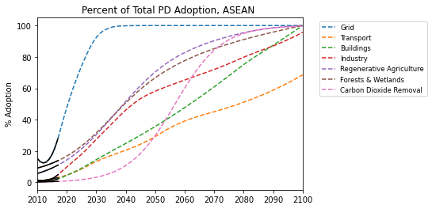

 

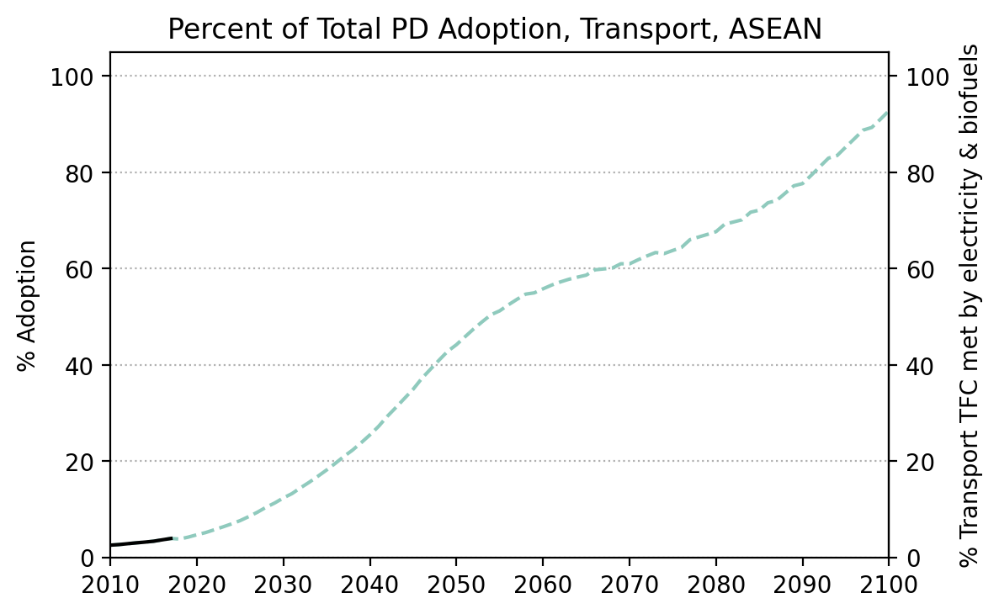
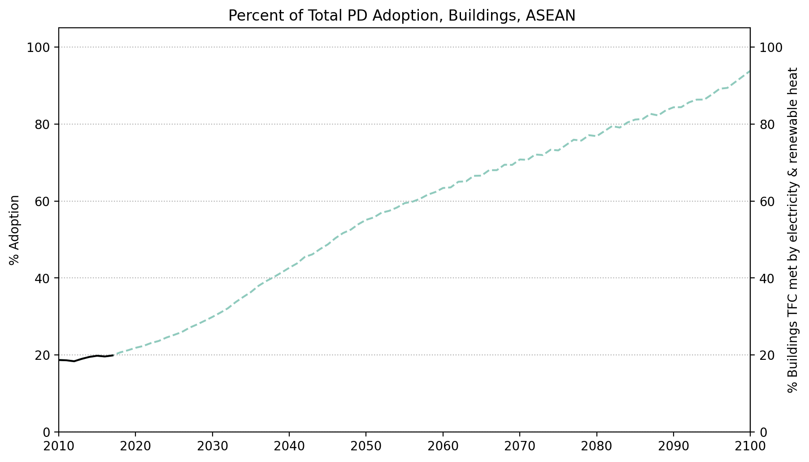
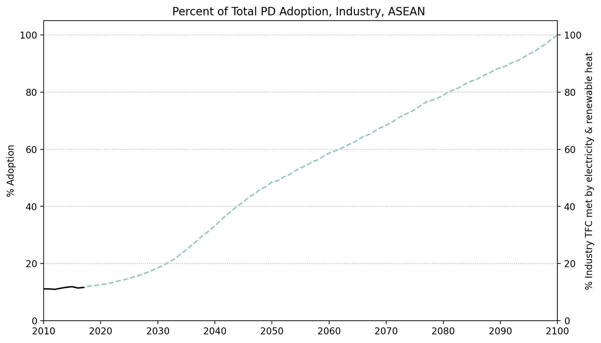
  
  
  

  

### Energy Supply & Demand

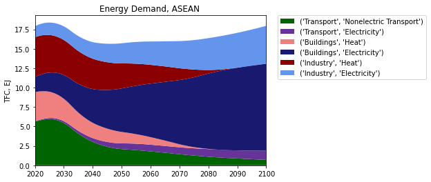  
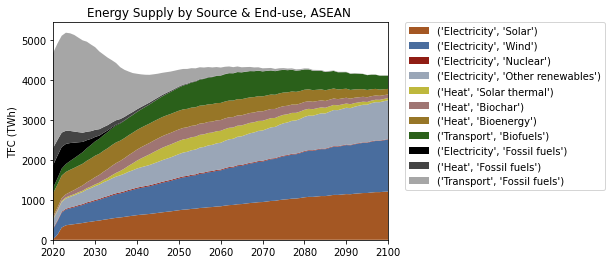  
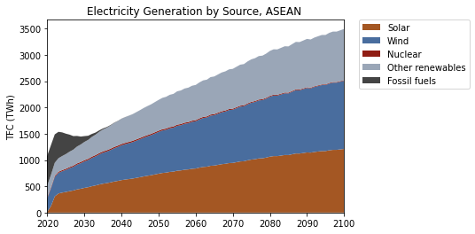  
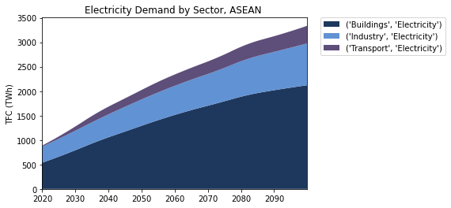  
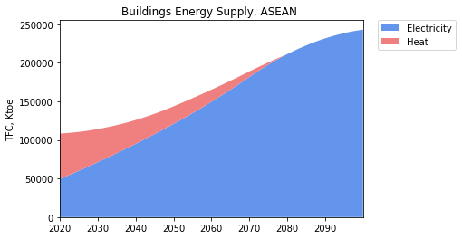  
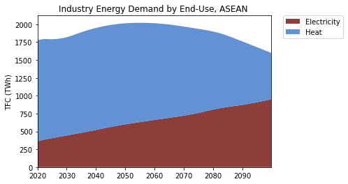  
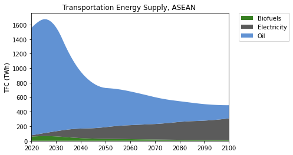  

  

### Natural Climate Solutions

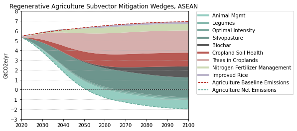  
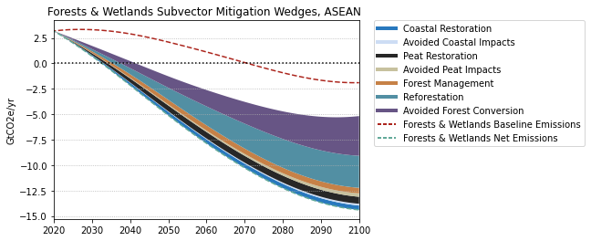  
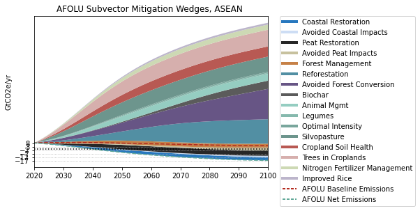  

  

### Carbon Dioxide Removal

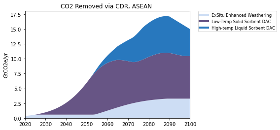  

