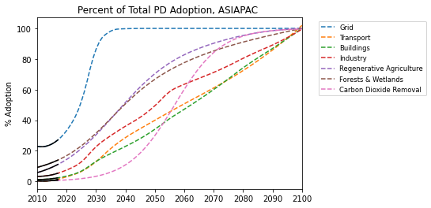

# Asia Pacific

Southeast Asia regional grouping, Australia, Bangladesh, China, Chinese Taipei, India, Japan, Korea, Democratic People’s Republic of Korea, Mongolia, Nepal, New Zealand, Pakistan, Sri Lanka, Afghanistan, Bhutan, Cook Islands, Fiji, French Polynesia, Kiribati, the Lao People’s Democratic Republic, Macau (China), Maldives, New Caledonia, Palau, Papua New Guinea, Samoa, Solomon Islands, Timor-Leste, Tonga, Vanuatu

### Adoption Curves

 

  

### Emissions

  

  
  
  

  

### Energy Supply & Demand

  
  
  
  
  
  
  

  

### Natural Climate Solutions

  
  
  

  

### Carbon Dioxide Removal

  

