# Advanced Economies

Australia, Austria, Belgium, Canada, Chile, Czech Republic, Denmark, Estonia, Finland, France, Germany, Greece, Hungary, Iceland, Ireland, Israel, Italy, Japan, Korea, Luxembourg, Mexico, Netherlands, New Zealand, Norway, Poland, Portugal, Slovak Republic, Slovenia, Spain, Sweden, Switzerland, Turkey, United Kingdom, United States, Bulgaria, Croatia, Cyprus, Latvia, Lithuania, Malta, Romania 

### Adoption Curves

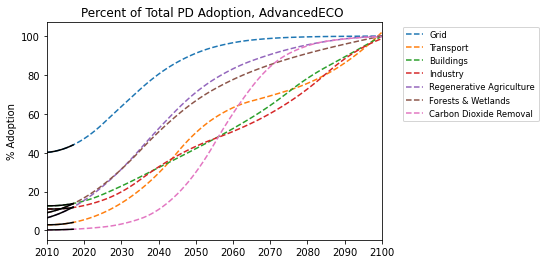

 

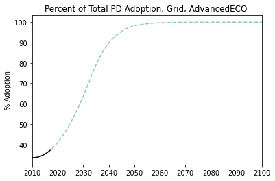
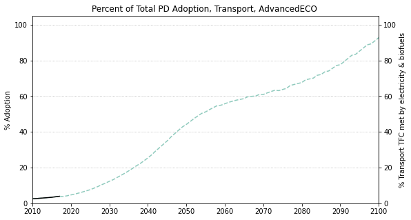
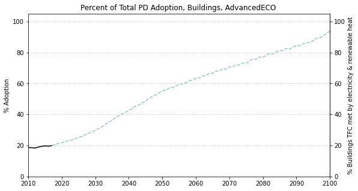
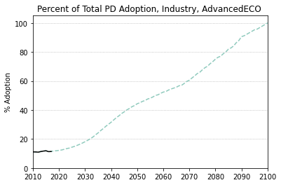
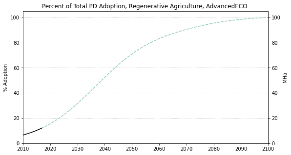
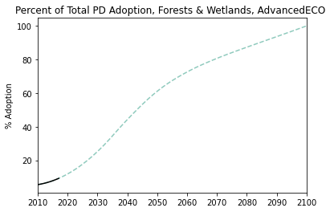
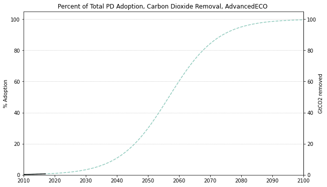

  

### Emissions

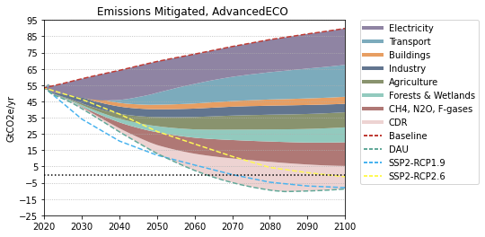

  

  
  
  

  

### Energy Supply & Demand

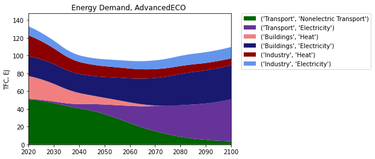  
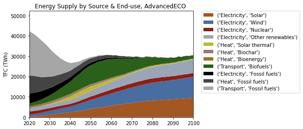  
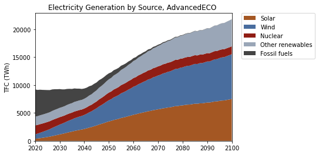  
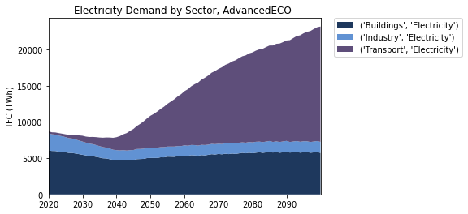  
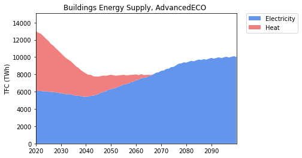  
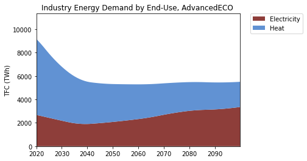  
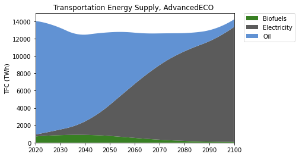  

  

### Natural Climate Solutions

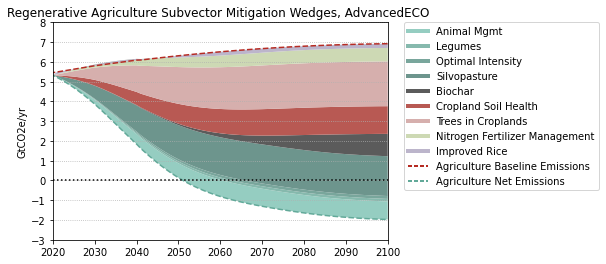  
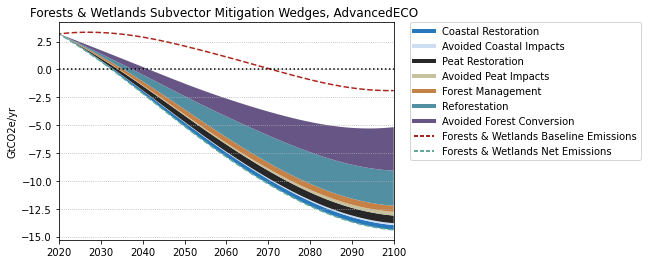  
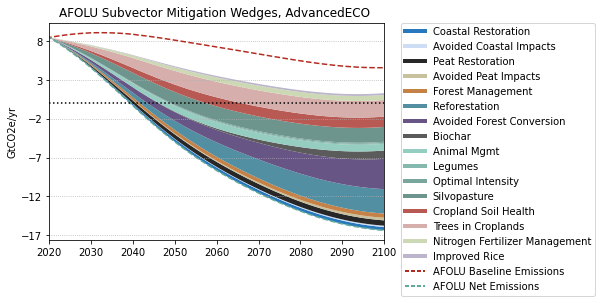  

  

### Carbon Dioxide Removal

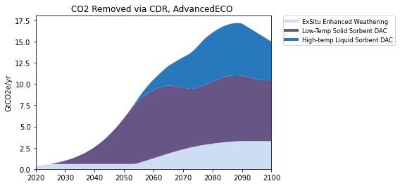  

