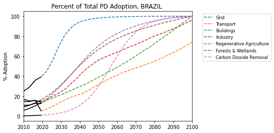

# Brazil

### Adoption Curves

 

  

### Emissions

  

  
  
  

  

### Energy Supply & Demand

  
  
  
  
  
  
  

  

### Natural Climate Solutions

  
  
  

  

### Carbon Dioxide Removal

  

