# China

### Adoption Curves

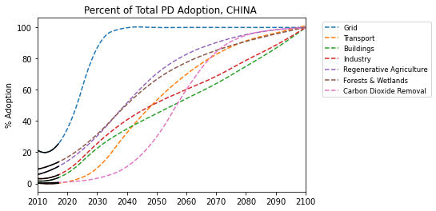

 

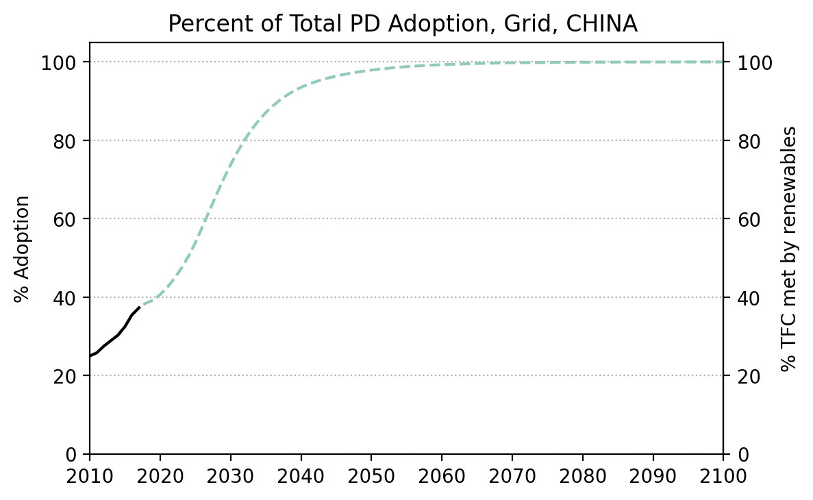
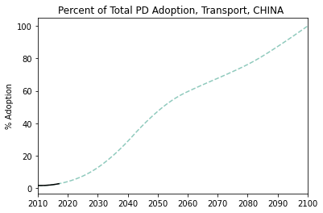
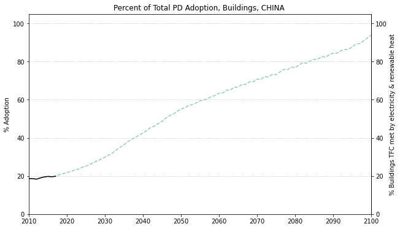
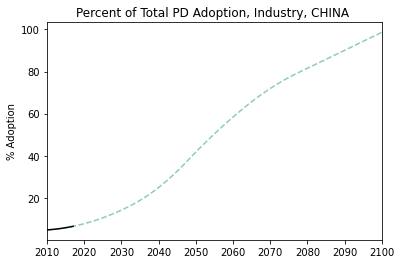
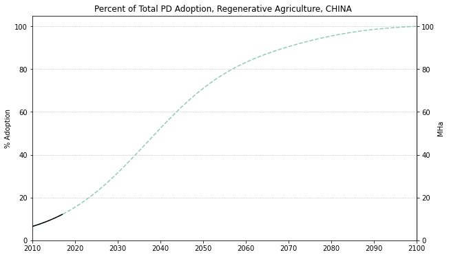
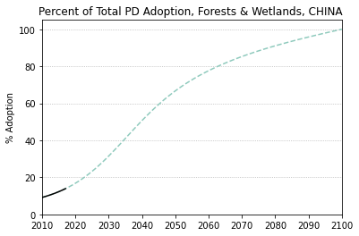
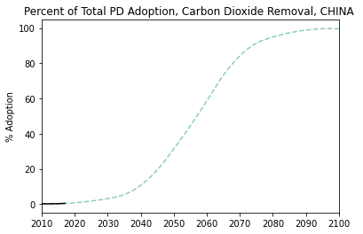

  

### Emissions

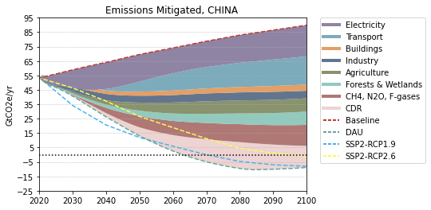

  

  
  
  

  

### Energy Supply & Demand

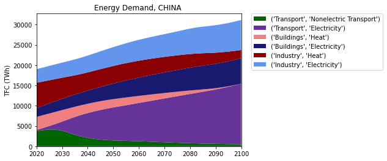  
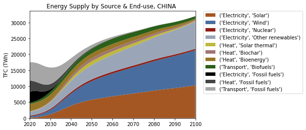  
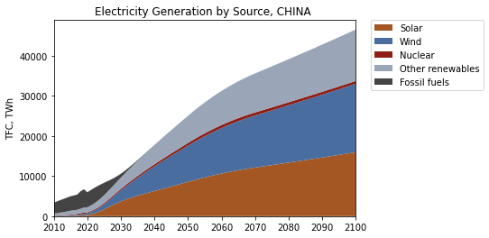  
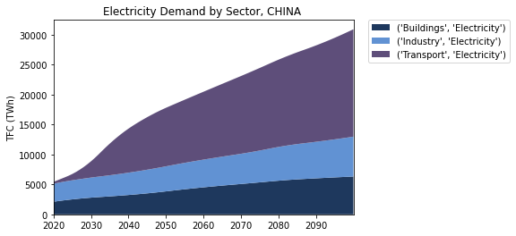  
  
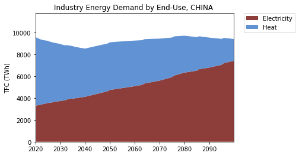  
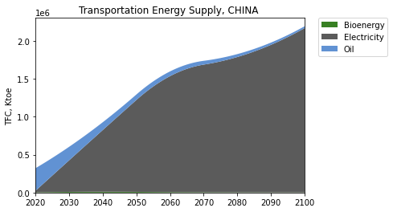  

  

### Natural Climate Solutions

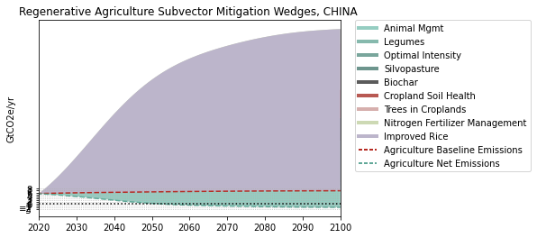  
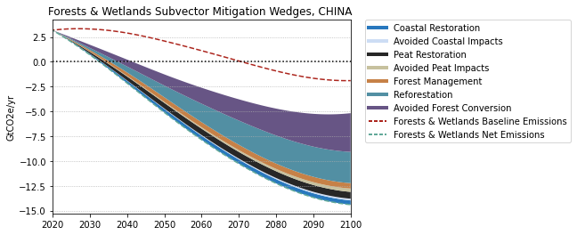  
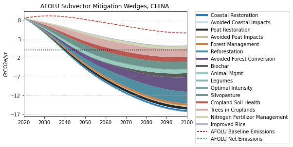  

  

### Carbon Dioxide Removal

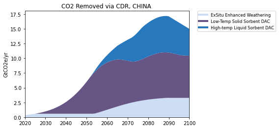  

