# Central and South America

Argentina, Bolivia, Bolivarian Republic of Venezuela, Brazil, Chile, Colombia, Costa Rica, Cuba, Curaçao, Dominican Republic, Ecuador, El Salvador, Guatemala, Haiti, Honduras, Jamaica, Nicaragua, Panama, Paraguay, Peru, Suriname, Trinidad and Tobago, Uruguay, Antigua and Barbuda, Aruba, Bahamas, Barbados, Belize, Bermuda, Bonaire, British Virgin Islands, Cayman Islands, Dominica, Falkland Islands (Malvinas), French Guiana, Grenada, Guadeloupe, Guyana, Martinique, Montserrat, Saba, Saint Eustatius, Saint Kitts and Nevis, Saint Lucia, Saint Vincent and the Grenadines, Saint Maarten, Turks and Caicos Islands

### Adoption Curves

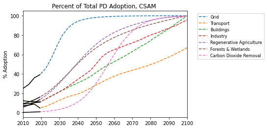

 

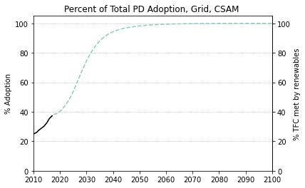
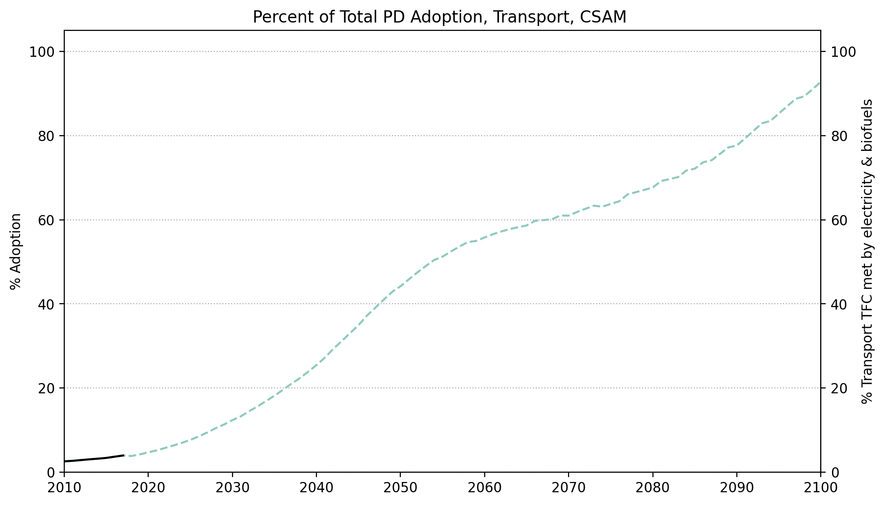
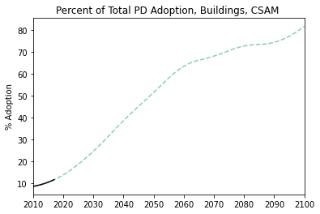
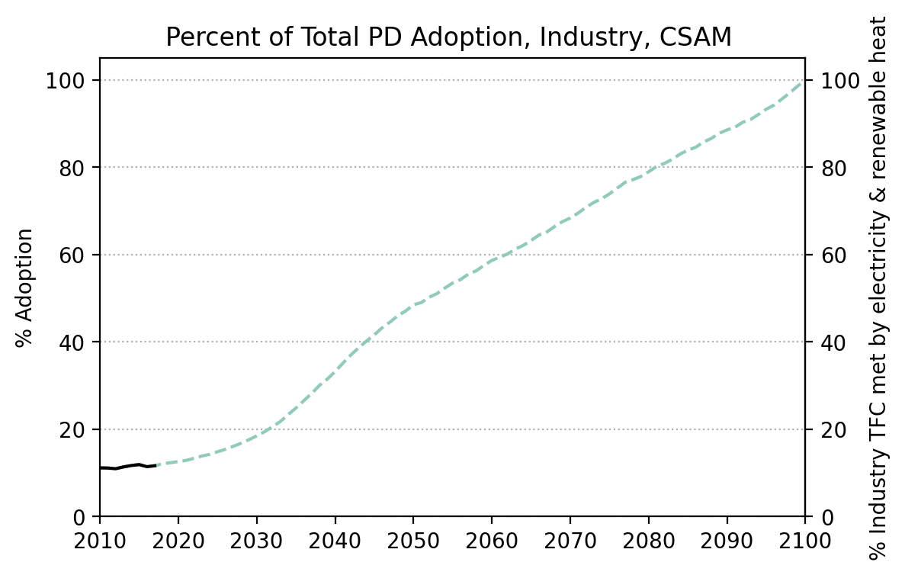
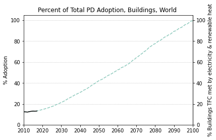
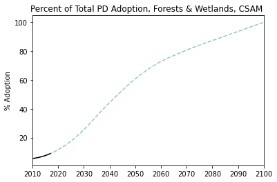
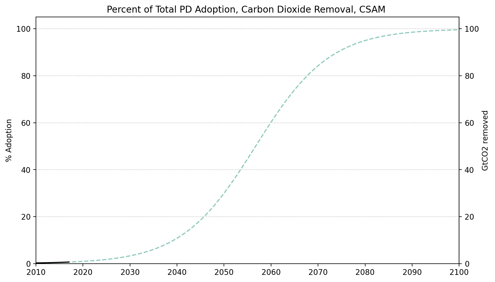

  

### Emissions

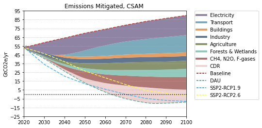

  

  
  
  

  

### Energy Supply & Demand

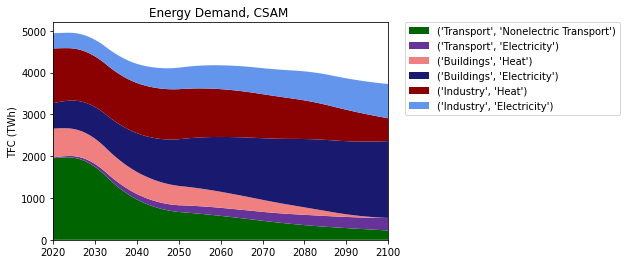  
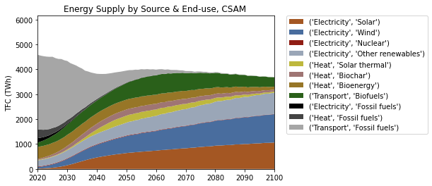  
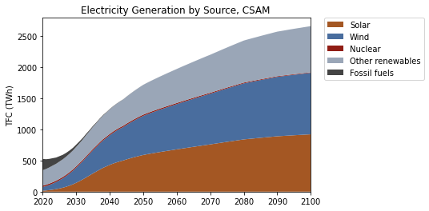  
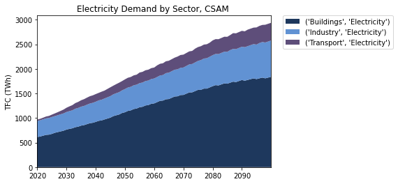  
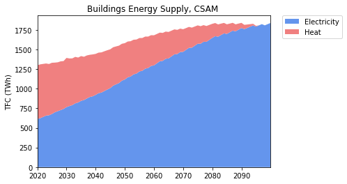  
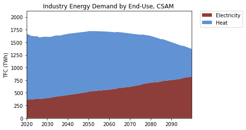  
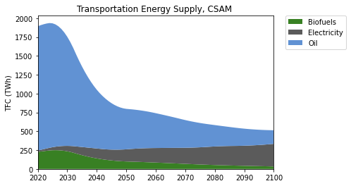  

  

### Natural Climate Solutions

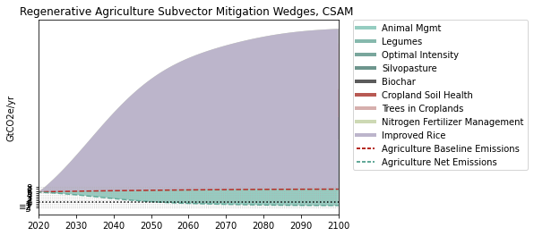  
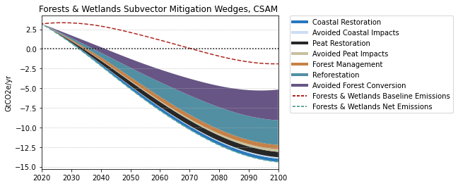  
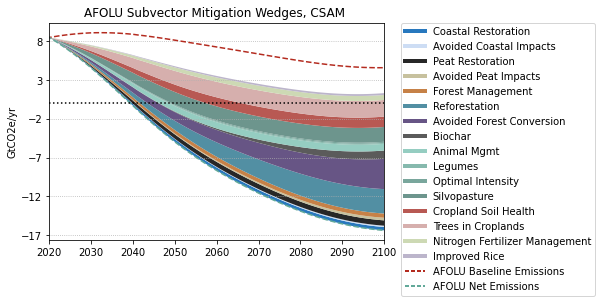  

  

### Carbon Dioxide Removal

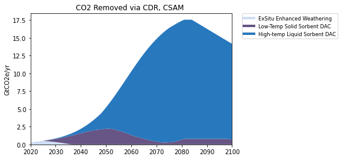  

