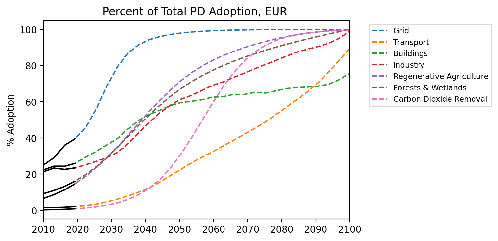

# Advanced Economies

European Union regional grouping, Albania, Belarus, Bosnia and Herzegovina, Gibraltar, Iceland, Israel5, Kosovo, Montenegro, Norway, Serbia, Switzerland, the Former Yugoslav Republic of Macedonia, Republic of Moldova, Turkey, Ukraine

### Adoption Curves

 

  

### Emissions

  

  
  
  

  

### Energy Supply & Demand

  
  
  
  
  
  
  

  

### Natural Climate Solutions

  
  
  

  

### Carbon Dioxide Removal

  

