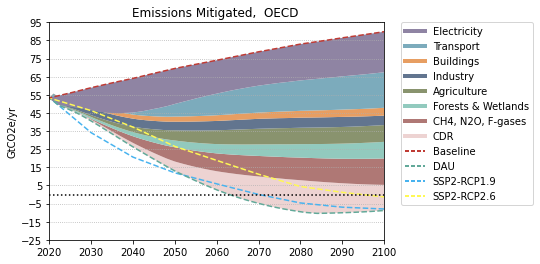

# OECD Nations

Australia, Austria, Belgium, Canada, Chile, Czech Republic, Denmark, Estonia, Finland, France, Germany, Greece, Hungary, Iceland, Ireland, Israel, Italy, Japan, Korea, Luxembourg, Mexico, Netherlands, New Zealand, Norway, Poland, Portugal, Slovak Republic, Slovenia, Spain, Sweden, Switzerland, Turkey, United Kingdom, United States

### Adoption Curves

<iframe id="igraph" scrolling="no" style="border:none;" seamless="seamless" src= "scurves-OECD.html" height="500" width="150%"></iframe>

 

### Energy Supply & Demand

<iframe id="igraph" scrolling="no" style="border:none;" seamless="seamless" src= "demand-baseline-OECD.html" height="500" width="150%"></iframe>

<iframe id="igraph" scrolling="no" style="border:none;" seamless="seamless" src= "demand-pathway-OECD.html" height="500" width="150%"></iframe>

<iframe id="igraph" scrolling="no" style="border:none;" seamless="seamless" src= "supply-baseline-OECD.html" height="500" width="150%"></iframe>

<iframe id="igraph" scrolling="no" style="border:none;" seamless="seamless" src= "supply-pathway-OECD.html" height="500" width="150%"></iframe>

### Emissions

<iframe id="igraph" scrolling="no" style="border:none;" seamless="seamless" src= "em1-OECD.html" height="525" width="100%"></iframe>

<iframe id="igraph" scrolling="no" style="border:none;" seamless="seamless" src= "em2-OECD.html" height="525" width="100%"></iframe>

