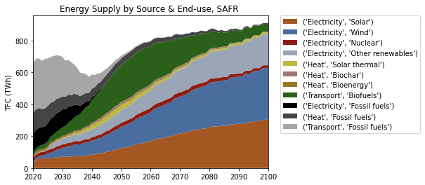
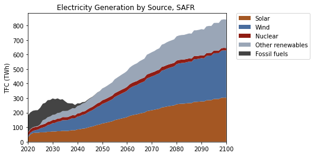
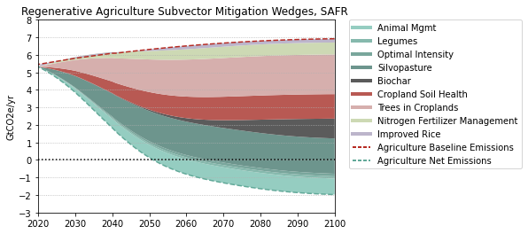
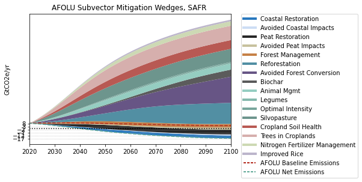
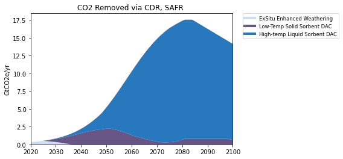

# South Africa

### Adoption Curves

<iframe id="igraph" scrolling="no" style="border:none;" seamless="seamless" src= "scurves-SAFR.html" height="500" width="150%"></iframe>

 

### Energy Supply & Demand

<iframe id="igraph" scrolling="no" style="border:none;" seamless="seamless" src= "demand-baseline-SAFR.html" height="500" width="150%"></iframe>

 

<iframe id="igraph" scrolling="no" style="border:none;" seamless="seamless" src= "demand-pathway-SAFR.html" height="500" width="150%"></iframe>

  
  

### Natural Climate Solutions

  
  
  

  

### Carbon Dioxide Removal

  

### Emissions

<iframe id="igraph" scrolling="no" style="border:none;" seamless="seamless" src= "em1-SAFR.html" height="500" width="150%"></iframe>

<iframe id="igraph" scrolling="no" style="border:none;" seamless="seamless" src= "em2-SAFR.html" height="500" width="150%"></iframe>

  